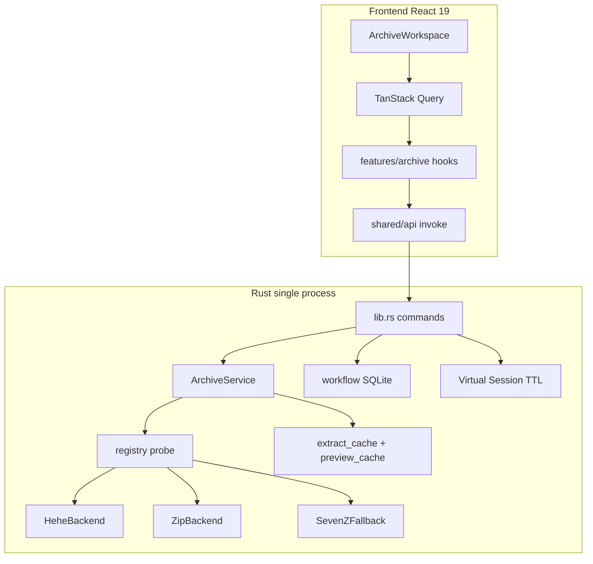

# Hehel Zip — Architecture (v0.3)

## Overview

Hehel Zip — Tauri v2 desktop app: React 19 + TypeScript frontend, Rust backend in one process.



## Archive layer

| Module | Role |
|--------|------|
| `backend.rs` | `ArchiveBackend` trait, `ExtractResult`, `BackendKind` |
| `registry.rs` | Magic + extension probe → backend selection |
| `archive_service.rs` | `Arc<dyn ArchiveBackend>` cache per canonical path |
| `hehe_backend.rs` | Native `.hehe` (HEHE magic) |
| `zip_backend.rs` | Native `.zip` via `zip` crate (`zip-native` feature) |
| `sevenz_fallback.rs` | ZIP/RAR/7z via bundled `7z.exe` |
| `path_safety.rs` | Zip Slip guard (camino, Windows reserved names) |
| `extract_cache.rs` | SHA256-keyed LRU cache for drag-out |

### Probe order

1. `HeheBackend` — magic `HEHE` or `.hehe`
2. `ZipBackend` — if `zip-native` feature + PK zip magic
3. `SevenZFallbackBackend` — remaining archives

## Security

- Extract paths validated via `path_safety::resolve_safe_extract_path`
- Partial extract: unsafe entries → `ExtractResult.skipped`
- Errors: `ArchiveZipSlip`, `ArchiveReservedName`, `ArchiveEntryNotFound`

## Frontend (FSD-lite)

```
src/
  features/archive/   — listing, statuses queries
  features/gallery/   — (future)
  entities/file-entry/ — ArchiveEntry types
  shared/api/         — TanStack Query client + invoke wrapper
  shared/ui/          — (future)
  app/                — existing workspace shell
```

## Events (multi-window)

| Event | Payload |
|-------|---------|
| `hehel:status-changed` | `archivePath`, `entryPath`, `statusId` |

Frontend invalidates `['archive', path, 'statuses']` on listen.

## Virtual Session

- Reuse `session-{archive_hash}` per archive while window alive
- TTL 30 min idle; `drop_extract_session` clears registry
- `extract_cache` (disk LRU) is separate from temp sessions

## IPC commands (new in 0.3)

- `list_archive_entries_paginated` — offset/limit for large archives

## Feature flags

- Cargo: `zip-native` (default on)
- Env: `HEHEL_USE_ZIP_NATIVE=0` отключает native zip при сборке с `zip-native`

## Observability

- `tracing` + `tracing-subscriber` (env filter `RUST_LOG`)
- Perf baseline: `docs/perf-baseline.md`
